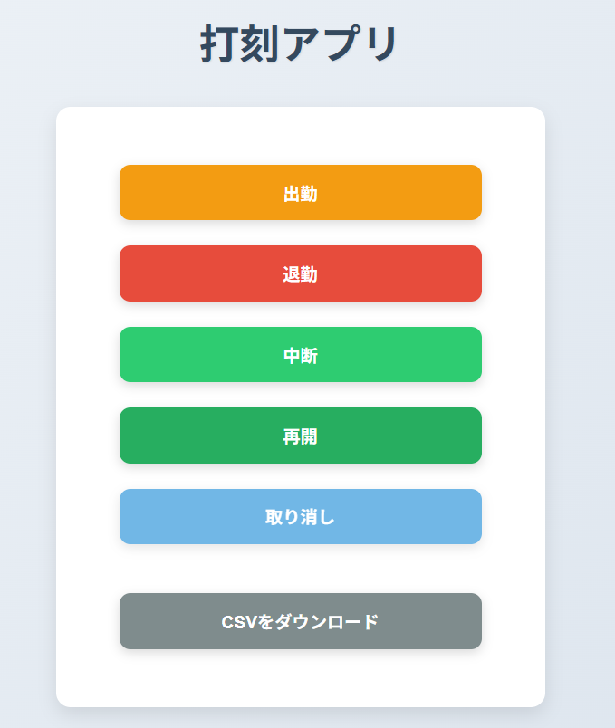
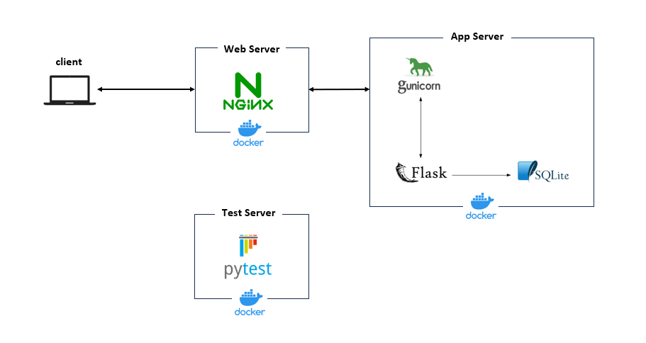

# dakoku_app

http://dakokuapp.com/

勤怠管理アプリ。

退勤時間を機械学習モデルが予測する。



## Overview



## Usage

セッション管理用のシークレットキーを環境変数として`.env`で用意。

### `.env` 

```
export SECRET_KEY=YOUR_SECRET_KEY
```

アプリの起動。

```
$ docker-compose up -d --build
```

## Running Tests

testコンテナにexecして

```
$ docker-compose exec test bash
```
実行
```
# pytest test
```